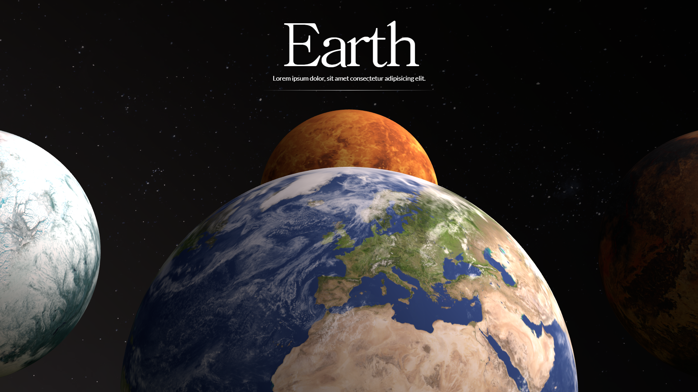

# ⚡ Cyberpunk Landing Page

An interactive planetary-themed landing page built with Three.js, TailwindCSS, and GSAP. Features rotating 3D planets, smooth scroll and swipe transitions, dynamic text animations, and a space-inspired HDRI background. Fully responsive and visually immersive, designed for a modern cosmic experience.

[](https://cyberpunk-landing-page-chi.vercel.app/)

---

## ✨ Features

- 🌍 **Rotating 3D Planets** arranged in a circular orbit using Three.js
- 🌠 **HDRI Space Environment** with a dynamic starry background
- 🎯 **Scroll & Swipe Navigation** to cycle between planets smoothly with GSAP
- 🧠 **Dynamic Text Animation** synced with planet rotation
- 💅 **Responsive Layout** styled using TailwindCSS
- 📱 **Touch Gesture** Support for mobile-friendly interaction
- ⚡ **Real-time Planet Rotation** for immersive viewing experience
- 💡 **Bloom post-processing** for glowing effects

---

## 🧠 How It Works

- Loads **planet textures** onto spherical meshes arranged in a circular layout
- Sets up a **realistic space environment** using an HDRI from PolyHaven
- Animates **planet rotation** and **heading transitions** using `gsap.to` on scroll and swipe
- Syncs **text transitions** with 3D planet rotation for a seamless experience
- Handles **responsive resizing** to maintain visual fidelity across devices

---

## 🛠️ Built With

- [Three.js](https://threejs.org/) - 3D rendering
- [TailwindCSS](https://tailwindcss.com/) - Utility-first CSS
- [GSAP](https://greensock.com/gsap/) - Animation
- [RGBELoader](https://threejs.org/docs/#examples/en/loaders/RGBELoader) - HDRI environment maps
- [TextureLoader](https://threejs.org/docs/#api/en/loaders/TextureLoader) - For applying textures to planet spheres
- [EffectComposer](https://threejs.org/docs/#examples/en/postprocessing/EffectComposer) – Post-processing pipeline
- [UnrealBloomPass](https://threejs.org/docs/#examples/en/postprocessing/UnrealBloomPass) – Bloom lighting effects

---

## Clone the repo

```bash
git clone https://github.com/its-riki-dev/cyberpunk-landingPage.git

# Install dependencies
npm install

# Start the development server
npm run dev

# Build for production
npm run build

# Preview production build
npm run preview
```

---

## 📄 License

- This project is licensed under the MIT License.
